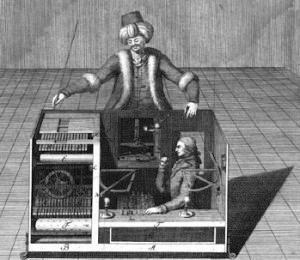

مقدمه‌چینی، توجیه، توضیح و تعریف کافی است. وقت آن است که به خوراک اصلی این کتاب برسیم - روندد واقعی تولید و تست یک پیش‌نمونه.

در ابتدا، انواع اولیه پیش‌نمونه سازی را برای شما معرفی می‌کنم و سپس به راه‌های تست آنها نگاهی انداخته و در نهایت تمام آنچه را آموخته‌ایم را در چند مثال کامل تجمیع می‌کنم.

# تکنیک‌های درهم برهم پیش‌نمونه سازی

روزی اگر این کتاب مبدل به یک  **چیز** _درست_ شد، من سرمایه زمانی بیشتری برای تولید ساختار سلسله مراتبی روش‌های پیش‌نمونه سازی میکنم که بصورت کامل با ساختار درست و بصورت رسمی این تکنیک‌ها را ارائه می‌دهد. در آن زمان به هر روش یک نام فانتزی داده، سناریو ایده‌آل استفاده از آن را ارائه کرده و مثال‌های بسیاری میزنم. اما از آنجایی که خود این کتاب هنوز یک پیش‌نمونه است، چیزی شما خواهید دید یک لیست درهم برهم از روش‌ها به همراه توصیف خام اینکه هر روش کی و چگونه مورد استفاده قرار می‌گیرد. 

لیست خلاصه این روش‌ها که قرار است در مورد آنها صحبت کنیم از قرار زیر است:

- **ترک مکانیکی** - انسان‌ها را جایگزین کامپیوترها یا ماشینهای پیچیده و گران قیمت کنید.

- **پینوکیو** - نسخه غیر عملیاتی و «مرده» محصول خود را بسازید.

- **کمینه محصول پذیرفتنی(یا محصول کوچک شده)**: یک محصول عملیاتی آن **چیز** رابسازید، اما آنقدر آنرا کوچک کنید که فقط ویژگی‌‌های اساسی باقی بماند.

- **استانی** - قبل از اینکه در کل جهان محصول خود را ارائه کنید، آنرا روی مجموعه کوچکی تست کنید.

- **در جعلی** - یک «ورودی» جعلی برای محصولی که اصلا وجود خارجی ندارد بسازید.

- **وانمود کنید که دارید** - قبل از سرمایه گذاری برای خرید هر چیزی که برای **چیز**تان به آن نیاز دارید، آنرا قرض گرفته یا اجاره کنید.

- **لیبل گذاری مجدد** برچسب جدید روی محصول فعلی که شبیه آن چیزی است که شما میخواهید آنرا تولید کنید بگذارید. 

در استفاده، سوء استفاده، استفاده غلط یا استفاده نابجا از هریک از این تکنیک‌ها آزاد هستید.آنها را ترکیب، پالایش، باز تعریف نموده و آنها را به دانش شخصی خود اضافه کنید. اگر شما یک روش جالب پیش‌نمونه سازی پیدا کرده و یا پیشنهادی در این مورد دارید حتما من را در جریان قرار دهید. آنرا توصیف نموده و به آن نامی بدهید و ممکن است من آنرا در نسخه بعدی کتاب بگنجانم یا در وبلاگم آنرا ارائه دهم.

حالا نوبت توضیح بیشتر در مورد هر تکنیک است.

# ترک میکانیکی

این تکنیک پیش‌نمونه سازی نامش را از یک «ماشین» بازی شطرنج به همین نام قرض گرفته است. این ماشین در انتهای قرن ۱۸ میلادی در سراسر دنیا به نمایش گذاشته شد. به مردم قبولانده می‌شد که «ترک» یک ابداع مکانیکی است که برنامه ریزی شده تا شطرنج بازی کند. در واقع، درون جعبه یک شطرنج باز با استعداد و کوچک قرار داشت که با استفاده از دسته‌های ماشین شطرنج بازی می‌کرد. 

پیش‌نمونه‌های ترک میکانیکی برای موقعیت‌هایی که می‌توان انسان را بصورت مخفی جایگزین تکنولوژی‌های پرهزینه، پیچیده یا نیازمند توسعه در آینده کرد ایده‌آل است. آزمایش تبدیل متن به گفتار آی بی ام نمونه به نقصی از این روش است. توسعه یک موتور تبدیل متن به گفتار سالهای زمان و سرمایه گذاریی عظیمی نیاز داشت اما یک تایپیست انسانی که در اتاق کناری مخفی شده بود به راحتی این کارایی پیچیده را شبیه سازی کرد. همانند شطرنج باز درون ترک میکانیکی. 

# پینوکیو

این روش پیش نمونه سازی از بلوک چوبی پالم پایلوت جف هاوکین بدست آمده است و نامش را از عروسک چوبی گرفته است که بعد از ملاقات با پری آبی تبدیل به یک پسر واقعی شد.

پیش نمونه پینوکیو برای حالاتی که سایز، شکل، وزن، حمل پذیری و غیره مهم است بهترین تناسب را دارد. همچنین در جاهایی که خیال‌پردازی فرد برای پر کردن جاهای خالی کافی است مناسب است. این دقیقا همان کاری است که جف هاوکین تظاهر می‌کرد که بلوک چوبی او قابلیت زمان‌بندی کارهایش، ذخیره شماره تلفن و یادداشت برداری را دارد.

# کمینه محصول پذیرفتنی(یا محصول کوچک شده)

کلمه کمینه محصول پذیرفتی توسط اریک ریس معرفی و به شهرت رسید. اریک خالق حرکت استارتاب ناب بوده و یکی از قهرمان‌های شخصی من است. 

همانطور که این نام پیشنهاد می‌کند، این تکنیک شام ساختن یک پیش‌نمونه‌ است که کاری را انجام می‌دهد(محصول واقعی). اما ویژگی‌ها و کارایی‌ها تا رسیدن به حداقل حذف شده اند. این کار به منظور «جمع آوری حداکثر اطلاعات اعتبارسنجی شده از مشتریان با حداقل تلاش» است.

از آنجایی که در کمینه محصول نیازمند یک ویژگی و کارایی اولیه هستیم این روش پیش‌نمونه‌سازی کار بیشتری نسبت به روش‌های پینوکیو و ترک مکانیکی می‌برد. اما این محصول کمینه بسیار سریع‌تر از محصول اصلی توسعه می‌یابد زیرا از شر تمام ویژگی‌های غیر حیاتی راحت شده است. یک محصول کمینه برای نرم افزار دفتر خاطرات خانودگی تنها از ورودی متن و شاید در کنار یک عکس پشتیبانی می‌کند و از فونت‌های گوناگون برای متن، ویدئو یا اشتراک گذاری‌های متفاوت را پشتیبانی نمی‌کند. این ویژگی ممکن است خوب بوده و حتی برای موفقیت محصول نهایی مورد نیاز باشند اما بایستی پس از بررسی اولیه این موضوع که دفتر خاطرات خانوادگی یک **چیز** _درست_ است یا نه، اضافه گردد. 

> همانطور که قبلا هم اشاره کردم، من در مورد محصول کمینه ماشین استارتاپ ناب چند ماه بعد از اینکه صحبت در مورد پیش‌نمونه سازی و ساختن آنها را شروع کرده بودم شنیدم.در یک ورک شاپ، من در مورد این محصول کوچک شده(نامی که من در آن موقع از آن استفاده می‌کردم) یک نرم افزار موبایل صحبت میکردم و کسی از حضار به من گفت که: «این چه تفاوتی با مفهوم محصول کمینه پذیرفتنی اریک ریس دارد؟» من آن موقع جواب قابل قبولی نداشتم. اما بعد از یادگرفتن در مورد محصول کمینه و کارهای اریک ریس متوجه شدم که محصول کمینه و پیش‌نمونه سازی(به همراه روش ماشین استارتاپ ناب) قصد دارند تا به کارآفرینان، سازندگان و مخترعان کمک کنند که یک اشتباه اساسی را انجام ندهند: سرمایه گذاری مالی و زمانی زیادی برای ساختن محصولاتی است که بازاری نداشته یا بازار قابل قبولی که ارزش این سرمایه گذاری را داشته باشند ندارد.
> 
> اگر شما به این کتاب علاقه مند هستید، شما باید کتاب استارت آپ ناب اریک ریس را خریده و بخوانید. این یک کتاب عالی است که همه بهتر است آنرا بخوانند چه آنهایی که در یک استارت‌آپ مشغولند و چه آنهایی که در شرکت‌های بزرگ کار می‌کنند. 

# محلی

در بسیاری از موارد، هزنیه اصلی تولید یک محصول توسعه ویژگی‌های اولیه نیست بلکه افزایش کارایی آن برای پشتیبانی از حجم زیادی کاربر است. یک پیش‌نمونه محلی ویژگی‌های اصلی محصول نهایی را فراهم آورده و محدوده (و کارایی) خود را به زیر مجموعه کوچکی از بازار هدف نهایی محدود می‌کند. مثل همیشه بگذارید با مثال این مورد را توضیح دهم.

بیایید فرض کنیم که سندرا ایده‌ای برای یک نرم‌افزار موبایل داشته که به افراد کمک می‌کند که رستوران‌هایی که غذای ارگانیک ارائه میکنند را پیدا کنند. بگذاری **چیز** سندرا را _دستیار غذای ارگانیک_ بنامیم.

یکی از پر هزینه ترین و زمان بر ترین بخش‌های این نرم افزار تولید و نگهداری پایگاه‌داده ای از رستوران‌های سطح کشور است که تنها غذای ارگانیک ارائه میکنند. ممکن است در کل کشور هزارن رستوارن از این نوع وجود داشته باشد و جمع آوری تمام آنها و نوشتن برنامه‌ای که آنها را به روز نگهدارد کار زیادی برای سندار خواهد داشت. کار زیادی که در صورتی که ایده _دستیار غذای ارگانیک_ یک **چیز** _درست_ نباشد غیر لازم بوده و به هدر رفته است.

یک نمونه محلی ممکنه به صورت زیر توسعه یابد: سندرا بایستی خود را به شهر یا بخش خاصی(بصورت ایده آل جایی که خود زندگی می‌کند) خود را محدود کند. از آنجایی که ممکن است تنها تعداد محدودی رستوران ارگانیک در محدوده‌ای که انتخاب کرده است باشد، توسعه نرم‌افزار بسیار ساده خواهد شد. سندرا میتواند نام و موقعیت رستوران‌ها را در برنامه _هارد کد_ کند بجای اینکه از یک پایگاه داده مرکزی آنها را بازیابی نموده و نزدکی‌ترین‌ها را به نمایش بگذارد. 

علاوه بر اینکه روش محلی روند توسعه نرم‌افزار ساده سازی کرده و به آن شتاب داده است، این روش زمان و کار مورد نیاز برای بازاریابی و تست بازار را نیز کاهش داده است. بجای تبلیغ نرم‌افزار در سطح کشور او می‌تواند روی بخش کوچک‌تری متمرکز شده و پول بسیاری را ذخیره نموده و یادبگیرد که آیا نرم‌افزار او یک **چیز** _درست_ است یا خیر؟

# پیش‌نمونه در جعلی

اسم این تکنیک از ارائه‌ی جس لی(یکی از بنیانگذاران و مدیر محصولات برند پلیور) گرفته شده است. جس بابت این اسم عالی ممنون!

با پیش‌نمونه در جعلی تنها نیاز ساختن یک «مدخل» یا «ورودی» برای یک محصول(یا ویژگی) بالقوه است. اصالا نیازی به وجود محصول(یا ویژگی) نیست. جس اینگونه می‌گوید که «در یک محصول تحت وب، بدین معناست که شما **وانمود** کرده که ویژگی وجود دارد و شما بررسی می‌کنید که آیا کسی روی آن کلیک خواهد کرد»

پیش‌نمونه در جعلی برای حالاتی که قرار میزان علاقه به آن **چیز** سنجیده شود مناسب است. 

در اینترنت یک در جعلی میتواند به عنوان یک لینک، یک دکمه روی صفحه وب یا یک تبلیغ تحت وب برای **چیز** شما باشد.

فرض کنید سندی به فکر نوشتن یک کتاب در مورد _مشاهده سنجاب‌ها_(یک از تنواعات سرگرمی عجیب مشاهده پرندگان) است. قبل از اینکه او ماه‌ها زمان ارزشمند خود را روی کتاب مشاهده‌ی سنجاب‌ها «یک مشاهدگر سنجاب کارکشته» بگذارد، سندی از پیش‌نمونه در جعلی را بکار می‌برد. به منظور درک علاقه‌ی افراد به این موضوع او یک تبلیغ تحت وب به چنین مضمونی درست می‌کند

> یک مشاهده گر سنجاب کارکشته. 
> تنها کتاب مشتاقان سنجاب.
> تنها ۹.۹۸ دلار. برای اطلاعات بیشتر اینجا کلید کنید.

او می‌تواند با استفاده از سرویس تبلیغات گوگل تبلیغ و سایت مرتبط با سنجاب خود را به افرادی که به دنبال «مشاهده سنجاب» می‌گردند به نمایش بگذارد.

ما همچنین یک مثال کامل‌تر از این روش را در فصل «کنار هم قرار دادن تکه‌ها» خواهیم داشت. من مطمئن هستم که شما و مابقی مشاهده کنندگان سنجاب نمی‌توانید تا آن موقع صبر کنید. 

# وانمود کنید دارید

برخی از **چیز**ها ممکن است نیاز به سرمایه‌گذاری اولیه بسیاری داشته باشند در این حالت‌ها،حیاتی است که پیش‌نمونه‌ی ایده شما آن اشیاء گران قیمت را قرض گرفته یا اجاره کنند. 

کسب و کاری که به عنوان مثال نیاز به یک مغازه فیزیکی داشه باشند تا زمانی که از مناسب بودن ایده خود اطمینان ندارند نباید به یک قرارداد ۵ ساله اجاره تن در دهند. آنها می‌توانند یک قرار داد سه ماهه یک فضای کوچک راگرفته یا حتی در حالت بهتر بخشی از مغازه کسی را که خریدارانی مشابه دارد جایی را اجاره کنند. 

ایده شرکت ارائه خدمات قرض ماشین‌های _سبز_ که تنها ماشین‌های الکتریکی را اجاره می‌دهد را بایستی با اجاره یا قرض چند ماشین برقی برای چند هفته تست کرد بجای اینکه یک مجموعه از آنها را در ابتدا خرید. 

اصل مطلب بیان شد. تا زمانی که مطمئن نیستید یک **چیز** _درست_ را دارید همه چیز را ارزان تمام کنید.

# ملاحظات اخلاقی

برخی از این ایده‌ها از نظر اخلاقی ممکن است شما را در محضوریت قرار دهد مگر اینکه شما روانپریشی با اختلال شخصیت مرزی باشید. آیا واقعا درست کردن یک «در جعلی» برای اینکه بسنجیم آیا افراد روی آن کلیک می‌کنند درست است؟

من بسیار دز این مورد فکر کرده‌ام و به نتیجه زیر رسیده‌ام:

**چیز**های _غلط_ مسئول هدررفت‌های بزرگ هستند. آنها زمان افراد زیرکی را که مسئول توسعه آنها هستند را هدر می‌دهند همچنین پول و سرمایه‌هایی طبیعی را که می‌تواند صرف ساختن چیزهای بهتر و کارا تر شوند. زمان، هزینه و منابعی که روی **چیز**های _غلط_ سرمایه گذاری می‌شوند همان زمان، هزینه و منابعی است که از **چیز**های _درست_ دزدیده می‌شوند. 

به تمام محصولاتی که خریده‌اید و تنها یکبار یا دو بار قبل از دورانداختن یا جایگزین کردن، از آنها استفاده کرده‌اید فکر کنید. به تمام محصولات فروخته نشده‌ای که از محل دفن زباله سردر می‌آورند فکر کنید. 

پیش‌نمونه سازی می‌تواند  شما  و مشتریان بالقوه شما را از هدر دادن زمان و پول زیادر روی **چیز**های _غلط_ نجات دهد.

از قضاوت و اخلاقیت خود هنگهم توسعه و تست پیش‌نمونه‌ها کمک بگیرید و قطعا شما شب به آرامش خواهید خوابید.
